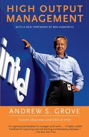
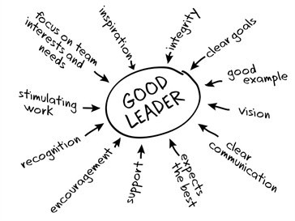
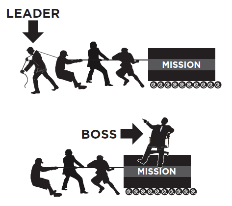
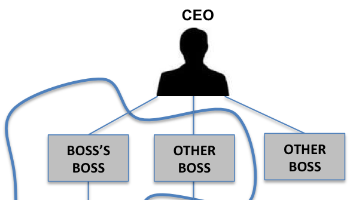

*An exploration of Andy Grove’s management style for leader’s old & new…this is the first of non-fiction books I will read & write about every 2 weeks, all thoughts are my own…*

#A cult management style in Silicon Valley
I’m starting my 2017 resolution to read more and write more with an exploration of what many consider the bible of management best practice instilled by Andy Grove at Intel throughout his rein as CEO. My goal is to distill the content down into manageable chunks of information with additive value based on my own experience of management across various staff & leadership teams I have been on.

It is rare that the CEO of a company instills such a strong & pervasive management philosophy that cascades throughout an organisation — typically at most corporate companies there are various flavours of what good management looks like & nurturing of different philosophies is encouraged which has it’s advantages but can sometimes create a lack of consistency in execution of the vision — Intel however is not one of those companies with Grove being widely credited for operationalising much of the management philosophy we see in Silicon Valley and in it’s global imprint today. ‘High Output Management’ is a business leadership book for any leader old or new in business, whether you are founder of a small start-up or a Fortune 100 CEO Grove’s work has received cult-status amongst leadership circles. Ben Horowitz is the much publicised sponsor of it’s management principles and many dynamic leaders from Mark Zuckerberg to Marc Andressen credit Grove with heavily influencing their personal leadership and management style.

<figure class="float-left" style="width: 240px">
    
    <figcaption>High Output Management</figcaption>
</figure> 

##Andy Grove — High Output Management
Authenticity, candidness and transparency is at the centre of Grove’s approach to management and business leadership and it is because of this that this is a management book I always recommend — Grove’s authenticity throughout the book resonates as it shines a light on the tough lessons he wanted leaders to learn and what he as a leader found challenging from navigating organisational complexity in scaling to building top-performing teams. Looking at the Grove’s management philosophy it can be embodied in a simple formula which I’ve outlined below — Andy maintains great management is best achieved through training, motivation & influence which I’ve termed the ‘Functional Triangle of Management’ further below. ‘A manager’s output = the output of his organisation + the output of the neighbouring organisations under his influence’

Throughout Grove’s 17 chapters 3 themes emerge which I’ve repurposed below :
* Your effectiveness as a leader — building organisational output
* Leading teams — creating a team of team’s
* Navigating organisational complexity — manage complexity in scaling

##Your Effectiveness as a Leader

In my view processes and outcomes are as effective as the leader’s direction, the goal in any management process from sales methodologies to program management to product development to product marketing briefs & OKR’s should focus on effectiveness not efficiency — efficiency in process is easy, effectiveness is not. Grove embodies this in what he calls the ‘Managers Production Line’ and operationalising a Manager’s production line to work for you as an individual, much of what Grove talks about in this chapter is common-sense management & productivity but I have seen Manager’s make mistakes on these regularly — practice makes perfect here. Key Takeaways for Grove sit around managing the energy of the team most effectively, this is one of the core responsibilities of any Manager and team energy can decrease where the below are mis-managed :

The Functional Triangle of Management — Train, motivate & influence your organisation, team, business unit through information gathering, decision-making, ‘nudging’ (escalating) and avoid abdication, delays in decisions, these are the highest leverage tasks of a Manager.

<figure class="float-left" style="width: 240px">
    
    <figcaption>Lead through motivation and influence</figcaption>
</figure> 

Meetings — what is efficient may not be effective for your organisation, your team, or you — optimise your meetings broadly across 4 types and ensure you do not duplicate purpose or cadence; process-oriented, mission-oriented, 1:1’s and staff meetings
Decision-making — implement the correct decision-making forum and involve the correct individuals inclusive of knowledge workers, decision workers and opposing thoughts — this is an area Managers can make mistakes, knowledge workers are on the front-line and closest to market & product inclusion of knowledge workers is often ignored and taken for granted to master this the RACI matrix is particularly effective at resolving decision making
Team Output — agree with your team on what the key indicators of successful output are and how these will be measured, communicated and built upon over a QTR — what are the ‘vital few’ to be measured ?
Management by Objectives — ensure focus on business unit and corporate strategy through OKR’s — Objective : Key Results — these are best managed through SMART criteria for staff teams and for your reports — DRI, hold your team accountable to these & their importance.
Your Production Line — theme your week, people days, team days, product days, OKR days, customer days, innovation days, standardise expectations on KPI’s, reporting cadence in your team etc..

##Leading Teams — Motivation & Training

Grove’s view on leading teams focuses less on vision-building, communication, team-norms, expectations and more towards a simplified but effective view that sits on training & motivation. Grove maintains that when a team breaks down it is usually because of individuals in the team where they can’t or won’t do something meaning they do not have the knowledge or lack the motivation — this can be solved by the Manager.
As a side note Managers can sometimes fail at understanding what individuals on their team are motivated by — are they motivated extrinsically ? (money, rewards) or are they motivated intrinsically ? (achievement growth). Grove naturally pushes for a clear understanding of this at Manager-level as once you understand this you can meet each individually around their immediate motivations and begin to broaden and influence motivations in their career towards a more holistic growth and development plan.

<figure class="float-left" style="width: 240px">
    
    <figcaption>Lead the developmental philosophy for your team</figcaption>
</figure> 

Grove firmly believes training & development to build excellence in your business unit is the job of the Manager & not a specialist or support team. In my view functional learning & development teams have key responsibilities in building transferable skills and developing the wider population but Grove’s perspective resonates as every Manager should own their direct skill-set and have accountability to the customer.
It is widely proven in organisations that attrition is lowest where the Manager has technical competence and knowledge economy in their reports day to day, in this vein Grove implies organisational risk in position power without knowledge power at Manager level and to mitigate against this.

In my experience great managers have both position power & knowledge power and accountability to a diverse range of stakeholders their team & end-customer being the most important, a manager who can train their team directly, creates consistency of output, high-standards and aids in succession planning.

Key Takeaways for Grove here also touch on :

* Poor performance — with poor performance partner with your report on clear objectives for what needs to change and a timeline if not resolved this should be dealt with immediately, it is damaging to A-players on the team and the overall vision

* Quitting — always have a bias towards a ‘save’ and partner with your peers where needed to ensure the individual’s needs are being taken into account — a good rule of thumb to remember here is that a report leaves a Manager not an organisation, make sure to take ownership of this on your team and no not scapegoat it is your responsibility
* Task Relevant Maturity — TRM touches on your reports ‘skill & will’ for certain roles & responsibilities — delegation is one of the most important tasks to master as a Manager — Master it well and your organisation will flourish but do not abdicate and ensure you are developing TRM across individuals in your team, here is a great article by my colleague Ameet Ranadive on TRM
* High Performers — My personal view on this is to let high-performers know they are high-performers in your team, stretch them, develop them, reward them, always coach them & do not move away from this they can always do better and strive for learning opportunities — the world’s top athletes need coaches and will not develop without them, it is the same for your team - Grove advises in being careful of pointing your top-performers towards the incorrect path for them and timing their progress into other roles to ensure their best development — if a top-performer in a growth move suddenly starts under-performing it is embarrassing for the report and Manger, map this out carefully. John C Maxwell has an interesting view on this ‘don’t send ducks to eagle school’ ducks are great at being ducks, eagles are great at being eagles — a duck cannot be a duck, an eagle cannot be an eagle.’

##Navigating Organisational Complexity
I’m a strong proponent of creating mission driven team’s that work towards a common goal and objective and reflecting this in the org structure, there should be no ambiguity around the vision or goal, the leader should clearly map out how to get there so there is accountability to the team which will create buy-in. Once this is established managing team expectations around cultural norms informed by the agreed vision becomes manageable. Grove touches on this in what he calls the CUA model — Complexity, Uncertainty and Ambiguity. According to Grove whether CUA is low or high in an organisation it is the Manager’s responsibility to align towards the vision and group interests. Your team in low CUA will become motivated extrinsically through rewards, bonus’s or their IDP versus high CUA (tough market forces) where they will become self-interested and potentially destructive towards the vision & team, being able to articulate the team vision is the antidote to high CUA, make sure there is one. In practice for high CUA environments the Manager must over-communicate and commit to doing this, where there is less to say to the team there is typically more to say and ownership of this falls to the Manager.

<figure class="float-left" style="width: 240px">
    
    <figcaption>Leadership is not defined by org structure</figcaption>
</figure> 

As any company grows and matures from embryonic to high growth to IPO so to will it’s org model — looking at some of the largest companies in the world there are many different types of org models which influence org & team structure this means organisational change will occur and being a champion of change management is the Manager’s role here.

Key Takeaways for Grove sit around timing and careful consideration of the org structure, good questions for every Manager to consider are around does it make the organisation move faster :

* The optimal org structure — examine pros and cons of centralised, de-centralised, geographical, functional, product-oriented or the matrix organisation. Typically centralised org structures offer consistency of output and high market leverage versus increased speed and agility in decentralised structures, with centralised org structures speed and agility can also be present where the team is mission-driven across multiple business units.

* Mission-driven teams — align closely with product teams, product marketing, marketing teams & dotted-line communication to other teams aligned to the mission

* Timing — timing & growth stage is the most important aspect of deciding when to implement changes to an org structure at the correct stage of people and organisational growth to future-proof the business and minimise future organisational changes where possible.

* Dual reporting — Grove highlights the matrix organisation where a team or business unit can have x 2 separate Managers, where in the right circumstances this can facilitate speed & market leverage — however in practice this is difficult and management books are littered with anecdotes of creating conflicting interests where this structure is used for mission-driven teams and a movement away from the ‘vital few’ metrics.

##What does this mean for Managers ?

In practice Grove offers a tangible perspective on business leadership devoid of softness that a lot of modern management philosophies now offer, it is valuable, relevant but only one story of management philosophy that Manager’s new and old can bring into their manifesto. If there is one thing I’d urge every Manager to take from Grove’s philosophy it is around owning your skill-set and providing meaningful additive direction to your business unit where you can empower & coach your business unit towards success, it was not in Grove’s modus operandi to manage for the sake of managing and in today’s fast moving knowledge economy doing so will put you and your organisation at a deficit.
