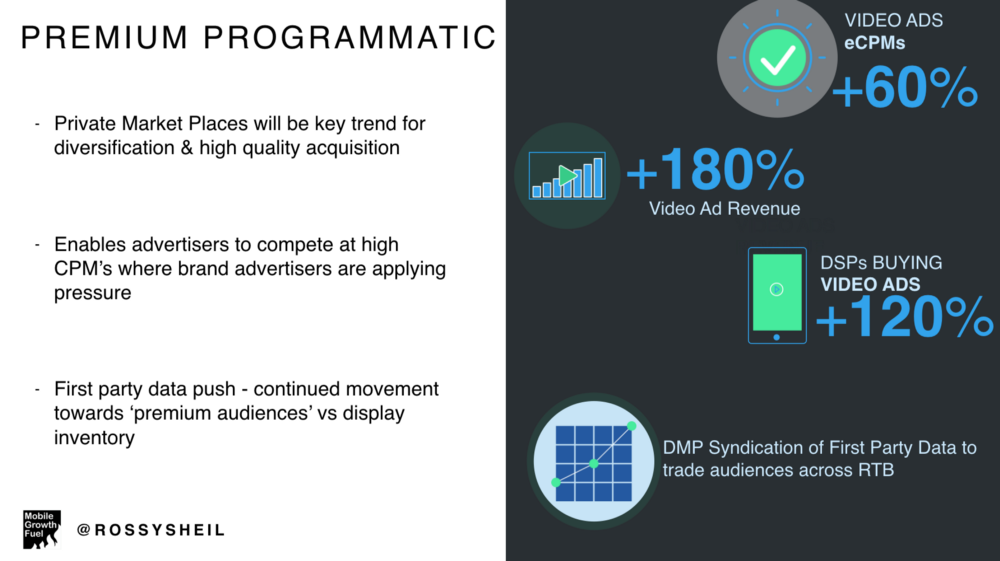

*A perspective on the market forces creating a competitive app economy & what this means for app marketing in 2017…*

On January 15th I delivered a keynote at #PGCLondon - Europe’s largest mobile gaming conference, you can find the slides from that presentation and my view below. 

<figure class="float-left" style="width: 400px">
    
    <figcaption>My Talk at PG Connects</figcaption>
</figure> 

Distilling my thoughts together for the conference I reflected on the state of mobile marketing in the app economy and market forces shaping marketers approach to app marketing in an age of limited supply, increased competitive forces and continued movement of power to the consumer.

* Forces driving the app economy
* What are the forces impacting app marketing ?
* There are three forces impacting marketers mobile app strategy moving into 2017 :
* App Store Dynamics
* Market Place Demand
* Evolved User Behaviour

#Mobile time cannibalizing other media time

A trend driven by consumers in recent years is cannibalisation of total time spent at the benefit of mobile but at the cost of other mediums. Mobile media time experienced almost triple digit growth in the last 3 years cannibalizing other media categories. 

<figure class="float-right" style="width: 400px">
    
    <figcaption>Mobile consumption time</figcaption>
</figure> 

Time spent with digital now represents 2/3 media minutes and in 2016 digital spend for the first time exceeded TV ad spend driven by the influx of ad dollars to mobile as other mediums were squeezed out by advertisers. As consumer’s shift their time to a multi-screen mobile environment their attention span has also changed, opening their smartphone 85 times a day and with an attention span lesser than that of a gold-fish! The consumption vessel is meeting the same pace of change and in the next 3 years alone 75% of mobile data traffic will be video-first.

Marketers can now think of video & mobile as being synonymous with one another but it’s this convergence of time spent and evolution in consumption that creates an expectation of in-the-now ‘mobile moments’ which consumers expect to resonate via sight, sound, motion & of course in a mobile environment — Twitter, Snapchat, Facebook, Tencent have captured this consumer trend strongly with proprietary video formats and stickers, lenses, filters & emojis but it has inadvertently heralded a shift in user time spent towards video-based apps & environments away from other categories.

Mobile’s cannibalization of other mediums has begun to look inwards at the medium itself where cannibalization has become a micro-trend across other categories in the app store.

##Is growth in app usage slowing down ?
User consumption trends inform product development and it’s undeniable that product stickiness is now seen amongst apps that ship product with a video-first mindset — mobile gaming apps are beginning to exhibit this trend more and more with Playrix, Plarium, King et al incorporating rich video assets into their games to satisfy consumer need for video consumption.

<figure class="float-left" style="width: 400px">
    
    <figcaption>User behavior is evolving</figcaption>
</figure> 

In a recent analysis from Flurry with a total sample size of 1 Billion apps across 2 billion devices exploring session & time spent data there was one clear category winner fully built on video communication and consumption ; messaging & social. Most significantly messaging & social were eating other app categories to the point where there was a strong case for cannibalization particularly in personalisation apps & gaming apps where the biggest deficit appeared, gaming was -15% for its consecutive year on user sessions and -4% on total time spent in the category.

<figure class="float-right" style="width: 400px">
    
    <figcaption>Time spent on apps</figcaption>
</figure> 

A decrease in time spent is not necessarily a causal metric for revenue decrease and gaming revenue was positive YoY for both Google Play & the App Store representing majority of IAP revenue with unexpected contributions from Niantic & Nintendo respectively — more and more category growth is dependent on blockbuster titles being released each year. On the whole user behaviour is booming in the app economy, total time spent in apps increased by over 150 billion hours year over year in 2016 — there is a key trend for marketers to embrace in both product development and marketing, video-first environments are dominating user & time-spent metrics.

##Marketplace — media as a commodity
It is never helpful to look at media as purely a commodity, commodity-based media buying devalues your entire marketing strategy — the industry has a long way to go in valuing mobile media for brand & performance advertisers but nonetheless there are certain principles of trading that apply. When a commodity increases in scarcity, it increases in value and based on supply demand economics the buyer will pay a premium but due to the premium the buyer must find methods to ensure the commodity they acquire retain’s its value and thus the buyer moves into optimisation & retention mode. In the short-term this is good for the seller but in fair, open economies it’s typically short-lived — the same principles apply in media.

##When demand meets supply ?
We have reached a tipping point in ad-tech where in the absence of a full-funnel marketing strategy buyers create churn & haemorrhage users rapidly. This is endemic in a landscape where there is limited focus on automation SDK’s to engage users post-install, the data below sets the scene for the macro & unit-economics of app marketing through to 2018.

<figure class="float-right" style="width: 400px">
    
    <figcaption>The mobile tipping point</figcaption>
</figure> 

The core issue is that the rate of mobile ad spend growth is exceeding the rate of smartphone adoption and taking a channel agnostic view the supply has a clear ceiling. Smartphone adoption grew at 3% YoY in 2016, the multiple of ad-spend to users in 2017 is 42X and 2.5X is the multiple at which the rate of mobile ad spend exceeds user growth in 2016 pro rata. This simply means that the mobile ad spend per user is increasing at an unsustainable rate which exceeds the supply available for app marketers focused on ROI.

This is compounded by the movement of brand dollars to mobile and the growth of ad-tech in recent years. There are over 1k vendor choices across social, mobile, search & programmatic, more DSPs buying on ad exchanges than ever before and touching the same users than ever before.
The demand landscape is also being squeezed where Google & Facebook have created a duopoly responsible for 99% of ad revenue growth in the most recent QTR and 85% of online ad revenue — it leaves a very limited slice of pie for ad tech companies to compete for & win.

##Is total unique audience a fallacy ?
The majority of app marketers can work with up to 10 different channels or many more at the top of the pyramid, this begs the question of whether app marketers are reaching a unique audience across their app marketing efforts and the extent to which lack of platform parity on mobile app attribution is painting an in-correct story of ROI.

Looking at attribution models in app marketing — first click, last click, assisted installs & view-thru there are general principles which apply but various platforms, ad networks, DSP’s can present attributed data to app marketers in different ways where user-colouring or paid activity taking credit for organics occurs very easily and is a real problem in a hyper competitive demand market. This is even more acute looking deeper on a category-level, across social, programmatic, video network, ad network level where in 2017 app marketers will begin to dial-back channel diversification to focus more on category diversification across the vital few where they are reaching unique users regularly.

The duopoly is indicative of scale only, there are smaller premium networks with strong ROAS which contribute heavily to user monetisation. In these scenarios where total unique audience is not present it is important marketers are content with attribution and arrive at partial attribution credit provided LTV or ROAS is evident. In this hyper competitive market the age of the mature marketing organisation buying only on unit economics focused on the vital few partners will become typical behaviour.

Ultimately the scene is set for limited inventory in mobile, ad platforms inclusive of Facebook & Google’s duopoly will be under buyer-pressure to increase the efficacy of their prediction models & algorithms with goal of maximising total audience, impression value and the rate at which those impressions convert — with increased & irrelevant impression exposure dilution of total unique audience and ad spend effectiveness is likely to occur at platform-level.

##App Store Discovery
App store discovery for android & iOS can be challenging, with any ranked ecosystem like music charts or box office charts it is typically a winner takes all economy but an open field in terms of access to building the next killer app. There are over 4M apps total in both stores, 4k released daily, only 5 apps used daily, it’s a real challenge to break through a crowded marketplace.

In the games business there is more complexity where gaming apps are maturing more quickly and exceeding their shelf life earlier — a game typically reaches 90% of its addressable install market in 90 days vs 180 days 3 years ago, the window for monetisation success is closing rapidly.

##Internationalisation to be a focus in 2017
Converging market forces, increased competition & pressure to monetise will force increased internationalisation of apps in 2017.
User Behaviour x Market Place x Discovery Challenges = 2017 Internationalisation. The discovery challenges in developed markets mean that games marketers need to focus on internationalisation and globally the app store is booming with $79 billion in revenue expected by 2020 thats a 2.2X growth over the next 3 years, 400 billion installs by 2020 and a 3X increase in revenue over the next 3 years alone since the inception of both stores.

In 2016 app store country trends were disrupted for the first time with China surpassing USA as the main source of iOS app store revenue and ARPU + time spent metrics in the east far exceeding that of the west ; some countries like Korea and Japan have 2x time spent of US users and Japanese ARPU in the Top 30 is 2x the aggregate of all other Top 5 countries in gaming.

##Growth in monetisation will come from emerging app economies
For most games marketers striking that balance between developed app economies and emerging app economies will be key in finding success — the next wave of meaningful growth in form-factor for games marketers will come from SEA, BRIC & APAC with a gradual decrease in smartphone adoption and total install volume in USA and EMEA who are close to peak form factor.

Most important is the monetisation curve of emerging markets, you can see above the monetisation curve of developed app economies as form factor improved, downloads will lay the ground work for delayed monetisation in emerging app economies as form factor improves particularly in SEA & BRIC territories. The above of course has ramifications for how app marketers are approaching their growth strategies for 2017, below I have outlined some of the emerging trends from 2016 which are expected to be widely adopted in 2017.

##Trend 1 — The Rise of Premium Programmatic

More and more app marketers are willing to pay out on a premium e.CPM where they see strong conversion rates due to first-look on inventory, of course app marketers need to be confident that the conversion rates will continue and are scalable.

PMP’s will enable app marketers to diversify their channel dependency & compete against brand advertisers who traditionally buy on reach & frequency in a e.CPM range, app marketers have an opportunity to be more competitive in this space where they see good performance.

Separate to PMP’s as a component of a wider app marketing strategy I believe we will see app marketers gravitate towards ‘audience trading’ & away from ‘inventory trading’ as these pools grow to be cost-prohibitive. Audience trading will become more efficient as first-party data and third-party data via marketplace and DMP syndication becomes more efficient with improved look-a-like modelling and algorithms.

##Trend 2 — Mass Adoption of Creator Marketing

Creator Marketing is now used in some shape or form by the majority of top app marketers, there is a long way to go in moving towards a deterministic attribution model, current attribution models are probabilistic at best solely uplift based similar to models used for TV in app marketing.

Many app marketers are shifting their entire brand budget to creator marketing like Seriously Games who was the poster child in gaming for effective creator marketing. The effectiveness of creator marketing lies in opening a new channel that is non-auction based which has very clear benefits in mid-long tail acquisition across social given the content lives on and is discoverable. Buying models in creator marketing are usually content or audience based meaning the fee is fixed so app marketers need to be comfortable in this. Given the gains made in automated sourcing, workflow approvals & talent management in 2016, 2017 should see the introduction of programmatic creator marketing complete with a dynamic buying model.

##Trend 3 — MarTech as Antidote to AdTech

AdTech has served app marketers indispensably in user growth but in retention, engagement & monetisation beyond the install has been lacking.
Intelligent automation SDK’s which enable bespoke on-boarding per acquisition source, A/B testing across UX, predictive analytics to enable automation of ‘mobile moments’, monetisation path maximisation will be the largest technology trend in 2017. 

To date most app marketers have viewed MarTech with CRM-only capabilities as complimentary to the app and not the app engine itself, this will change in 2017 looking at app marketing organisations maturing & market forces increasing.

##Trend 4–100% User Monetisation

As a range in IAP economies between 2% — 8% of users actually monetise via in-app-purchases, this leaves the majority of their audience completely un-monetised. At a time of premium CPM’s for publishers via mobile video & entertainment-driven video integrations for rewarded video this trend will quickly disappear in 2017 as 100% monetisation becomes a focus.

IAP technology and SSP technology typically do not communicate well in an app, there is limited understanding of user propensity to purchase due to lack of predictive modelling in a married SDK. Platforms with both measurement and SSP SDK’s are in the best position to achieve dominance in the market or alternatively closer relationships with MMP’s and SSP’s. Generally this is only positive as it helps boost user LTV which in-turn enables app marketers to acquire more premium users at higher volume.

##Trend 5 — ROAS to inform Demand Strategy

App marketers understanding of ROAS moved forward in leaps and bounds in 2016 with predicted retention, predicted monetisation and deep understanding of incrementally and frequency models, social contributors et al — however there are still gaps at user-level and ad-type level which create some inefficiencies in app marketing spend. 

New technology like Soomla is opening up further insights here which will close these gaps for marketers, 2017 will see a general movement away from standard display units as native, video & playable supply is opened up and forms the foundation of a ROAS marketing strategy.

##Trend 6 — AI to Power Creativity
In AdTech the single biggest use-case for AI is in assets & creative. Computing power & prediction models are at optimal level in ad-tech but a hugely neglected area is in creative optimisation.

Facebook has opened up an ecosystem to aid in creative innovation and combat ad fatigue and creative exhaustion which has the effect of limiting platform revenue and advertiser success. Similarly platforms like URU are using advance machine learning capabilities to disrupt the entire OLV industry with programmatic native placement in-video — this has very significant ramifications in mitigating against the limited supply environment in a non-intrusive & efficient way.

###Key Takeaways

In summary app marketing is in a state of flux — as smartphone adoption begins to mature in developed app economies and ad dollars continue to flow into the medium app marketers need to invest in creative approaches to user growth & monetisation, below are the key takeaways from my keynote.

* Marketplace, app store & user behaviour are converging to limit supply and create excessive demand.
* The rise of premium programmatic will aid in diversification with greater predictability of ROAS.
* Age of the mature app marketing organisation — unit economics mean tight LTV forecasting and buyers applying pressure to commodity costs.
* AI will open-up innovation in creative assets & programmatic video across a fragmented marketplace.

*Originally published by [Ross Sheil](http://rossysheil.com/) on [Medium](https://medium.com/rossysheil/).*
