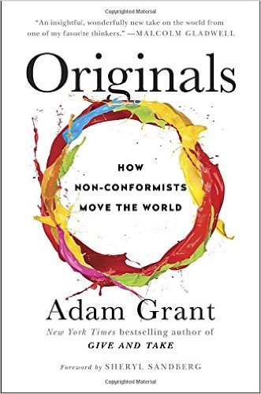
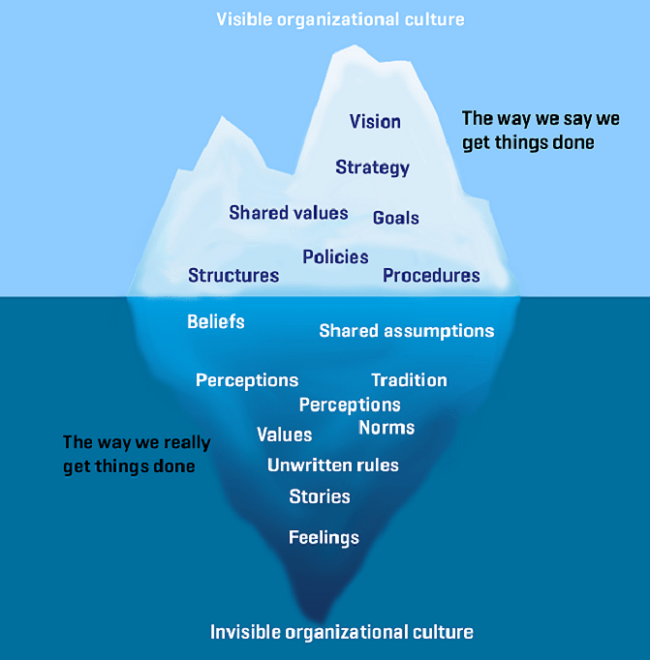
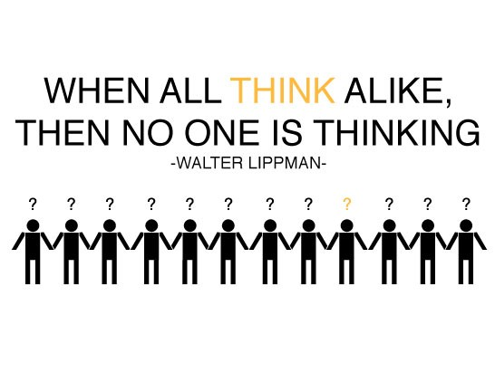
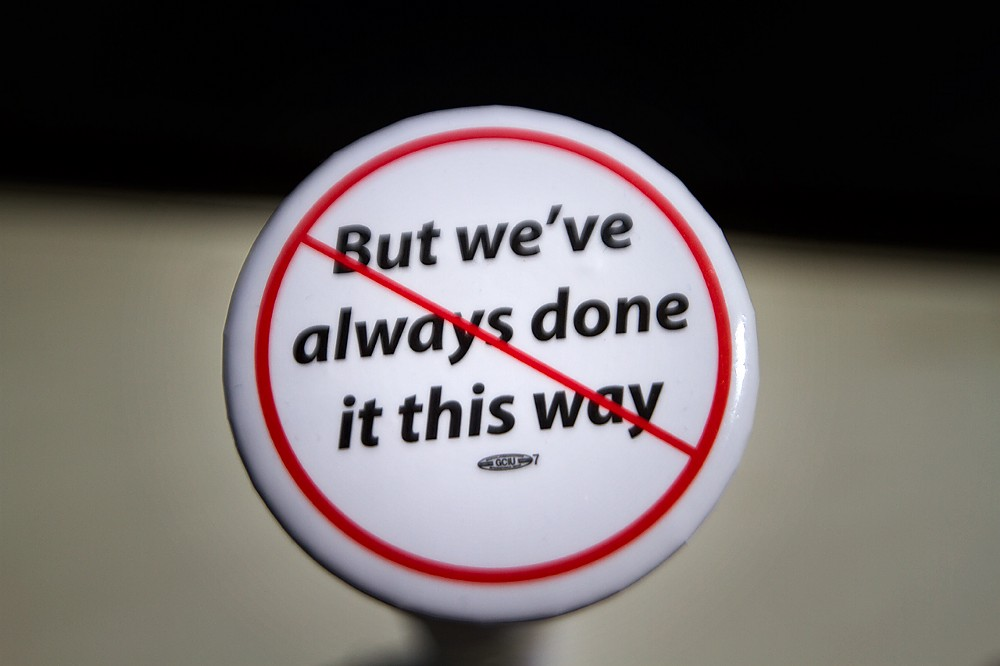
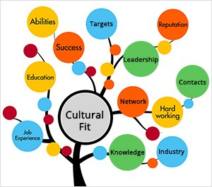

*The following is an exploration of Adam Grant’s ‘Originals’ and the key takeaways for building organisational creativity as a business leader.*

#Originality and Company Culture

How does the Fortune 100 continue to be innovative ? How do the most innovative contributors in tech companies always develop unique ideas ? the answer lies in ‘originality’ & the degree to which this can be taught or nurtured in individuals and companies.

<figure class="float-right" style="width: 400px">
    
    <figcaption>Originals</figcaption>
</figure> 

For Adam Grant in his book ‘Originals — How Non-Conformists Move the World’ the thesis of organisational originality is founded on strong company culture and the behaviours that culture encourages & celebrates amongst its wider population. Original and creative thinkers in technology companies flourish in places where diversity and divergent methods of thinking are valued in a non-hierarchical environment with forums and escalation paths in place to ensure creative ideas receive discourse and are pressure-tested.

However at many start-ups and tech companies intrapreneurship is not guaranteed and is sometimes an elusive practice amongst it’s wider populous for numerous reasons; culture, organisational structures or there can be a lack of know-how in individuals around how to create space in an organisation to lead or contribute to the innovation agenda and even when there is an idea in place how to navigate organisational complexity in bringing new ideas to the fore.

##Are Originals critical to performance?

‘Originals — How Non-Conformists Move the World’ is an evidence-based management book that focuses on a macro-analysis of trends & patterns of behaviour amongst individuals & organisation’s that are inherently creative combined with the business lessons that only a bias to originality & creativity can teach. Adam is a top-rated Professor of Psychology at The Wharton School and last year Originals claimed a #1 New York Times bestseller in the business category, the book is also heavily celebrated by Sheryl Sandberg who has written the foreword calling Originals one of ‘the most important and captivating books she has ever read’.

What does an ‘Original’ look like ? Looking at the silicon valley blueprint for strong culture there are many cookie-cutter implementations of what good culture or bad culture is which is not the focus here, — my goal is to extrapolate contributing factors to strong organisational culture & identity which aid in building an environment where ‘originals’ can do their best work.

Adam looks at originality as ‘rejecting the default and exploring whether a better option exists’. There are numerous behaviours & traits which contribute towards being an ‘Original’ those most prominent in Grant’s research are :

* Risk Mitigation — not a risk taker minimises risk before jumping
* Tempered Radicalism — ability to dial back tone of their ideas with long term plan
* Strategic Flexibility — understands how to seed ideas and leave open to change

Generally those who behave as Originals are those who excel at minimising their risk & maximising their safety net whether that is founding a new start-up or leading a provoking idea or change management agenda at their company. Those same individuals also understand how to temper their radical idea so they can be socialised and agreed to easily with a progressive agenda already in place but most importantly they strategically seed those ideas to allow for creativity in the process which Grant terms ‘strategic procrastination’ or ’strategic flexibility’.

In Grant’s presentation of what it takes to be original — first mover advantage, confidence & experience count for little — in some of the research presented those originals had 33% greater chance of success where they remained committed to their day job — according to Grant ‘if you’re risk averse and have some doubts about the feasibility of your ideas it’s likely it will be built to last, if you’re a freewheeling gambler your start-up is far more fragile’.

Grant does an exceptional job of bringing this to life looking at the stories of Founders from Nike, Warby Parker, Apple, Microsoft et al who all tempered their radical ideas with safety nets.

##How can you Create an Innovative Culture that Values ‘originality’ ?

In the tech economy it is now not uncommon to see major tech companies incubate employees and now founding teams of new companies in internal innovation labs. With rapid convergence of technology the worlds of software & hardware across b2c & b2b are colliding more than ever before and it’s a forcing function to ensure companies place intrapreneurship on top of the corporate agenda. Fostering a culture of originality then is top of mind for many companies across the globe as an un-desirable consequence of achieving a market-leading position is protection of that position and lack of creativity elsewhere.

<figure class="float-right" style="width: 400px">
    
    <figcaption>Organisational culture</figcaption>
</figure> 

Grant advocates that in certain respects management are inherently limited when it comes to innovation as management by its nature encourages achievement-motivation in teams which means teams focus on guaranteed success and stay away from big bets. Management can also draw on historical evaluative experience for what innovation looks like where false negatives can be easily created — it is here where experience can begin to limit creativity & where moderate expertise is most valuable looking at creative output in an organisation.

This has consequences for how management should engage and prioritise idea meritocracy across those individuals with lesser ‘power’, ‘status’ or ‘believability’ — which can be most seen in new hires or those individuals with lesser tenure or progression on the corporate ladder. As an unintended consequence of scaling this can unfortunately happen in large tech companies where some originals will need help & management sponsorship in progressing an idea — the onus is on the leadership team to ensure they create a culture where these ideas are valued and prioritised at all levels.

##Recruiting for Culture & Originality

At different points of an organisations lifecycle the pen portrait of hire a Founder or Manager will hire into the business will vary subject to priorities & dynamics in the business & industry at that time. Grant describes a piece of research from James Barron outlining three dominant hiring templates :

* Professional blueprint
* Star blueprint
* Commitment blueprint

The professional blueprint looks at skills like java, python, ruby, sales industry experience, the star blueprint focuses on future potential of the candidate & the commitment blueprint focuses on culture. Stars and professionals are generally given challenging tasks & autonomy whilst hiring for commitment meant a focus on that hire building bonds & amplifying culture whilst being able to satisfy the core requirements of the role. In Barron’s research ‘commitment blueprint’ hires had a failure rate of zero vs ‘star’ or ‘professional blueprints’ which had a 3x failure rate, odds of IPO were also 3x those of star or blueprint for commitment blueprints.

Key takeaways for any hiring manager here is to understand the type of hire you are looking for in building a team, a team full of commitment blueprints will not work, a team full of star blueprints will not work it is important to strike a balance being cognisant of where you are in your business lifecycle & future plans. Similarly encourage your team to bring dissenting views to your hiring meeting, dissenting views according to Grant offer you a 4x greater likelihood of hiring the most appropriate candidate.

##Avoiding Group-think and Encouraging Dissent

In some environments culture can be so cohesive & strong that groupthink can occur where management or staff teams are committed to a singular vision that crowds out any view on a more viable future alternative — organisations that have a very strong product identity & value prop are more susceptible to this than others. Grant tells the story of market leader Polaroid CEO Edwin Land who could not conceive of a world where film would not be used in digital cameras despite him championing the movement towards digital with Land & his management team being too focused on managing the profit margins from film instead of future-proofing the business & preventing disruption.

<figure class="float-right" style="width: 400px">
    
    <figcaption>Consensus is the enemy of innovation</figcaption>
</figure> 

This strong singular focus creates an environment where dissent, originality & divergent thinking is not valued and conformity is — in these scenarios management do not contribute to innovation through fear of losing reputation — of note are these comments from a former VP at Polaroid “I could never conquer the culture paradigms prevalent in Polaroid, the closed-minded thinking, many of us certainly drank the ‘Kool-Aid’.
Notwithstanding, cohesion absent singularity is generally positive in management & staff teams where each member should be confident in their position to disagree and provide dissent.

##Is Dissent an Effective Barometer of Culture ?

Grant pays special attention to Bridgewater Associates and their CEO Ray Dalio whose returns regularly exceed the profits of Google, Amazon, Yahoo, eBay. Bridgewater is known for its unique and exceptionally strong culture where it practices radical transparency, independent thinking, non-hierarchy environments, dissent & idea meritocracy. At Bridgewater feedback is delivered in public transparently, lay-employees regularly call out senior leadership on decisions, employees are openly ranked on 77 different attributes across determination, values, principles, confidence and many more available to the entire company.

<figure class="float-right" style="width: 400px">
    
    <figcaption>A dangerous phrase at tech companies</figcaption>
</figure> 

For Bridgewater CEO dissent & independent thinking was the litmus test for keeping his organisation & culture at peak health, he believed in the importance of dissent as being crucial to Bridgewater’ modus operandi and regularly employed tactics to surface dissent, on one occasion he sent the following email to the entire company :

*‘Of the people you work with on a regular basis, what percentage of those people would you rely on to speak up and to fight to make sense of things even when it’s difficult? Are you such a person? Let’s test your forthrightness. Of the people you work with, who is not doing their part to fight for right? (add exactly three answers) Have you told them? If not, why not?’*

So strong was Bridgewater’s cultural identity at pre-hire & hire stage that this approach fits the culture of it’s employees and communication norms, this works for Ray Dalio & Bridgewater but would be out of place in many other business environments. Dalio had a strongly held belief that organisational failure occurred ‘from the inability of people to have thoughtful disagreement to find out what’s true’ and it is this belief which informs the majority of Bridgewater’ culture manifesto.

Dissent whether the idea is right or wrong often brings alternative methods of thinking & real innovation in an organisation — as a leader encouraging dissent is your biggest treasure chest of creativity to draw-on. Effective leaders find methods of surfacing constructive dissent, a good example of this highlighted by Grant is Laszlo Bock SVP of People Ops where he established a review team — ‘canaries’ composed of a subset of googlers and diverse points of view at the company. The ‘Canaries’ were used as a sounding board for any significant policy changes the HR team would introduce at Google where the team was described as ‘our biggest complainers become our strongest advocates’.

##What got you here won’t get you there

Throughout the book Grant highlights a long laundry list of companies & industries that were disrupted, the fact that they were disrupted usually comes down to negligence in changing two crucial areas :

* Hiring strategy
* Questioning the business model

The values of a commitment based blueprint is clear but it also decreases in weighted value as the organisation matures & grows in hyper-competitive industries.Adam explores a study where post growth stage of start-ups commitment-based blueprints caused slower growth rates in market value, growing 140% slower than star blueprints and 25% slower than professional blueprints. This is further compounded in dynamic & unpredictable markets like technology where commitment-based blueprints become less diverse over time through recruitment of similar individuals in the team. This homogeneity makes it more difficult for these teams to recognise symptoms of disruption and the need to focus on diversity to survive.

Similarly a failure to question viability of business model as industries mature was evident across all organisations who failed to evolve, a failed dissenter at Polaroid recalls ‘we constantly challenged the notion of the current business model, the core business, as being old, antiquated and unable to go forward’ — in companies where achievement-motivation receives pride of place the voice of dissent is only valuable where idea meritocracy is also evident in the organisational DNA. 

<figure class="float-right" style="width: 400px">
    
    <figcaption>Additive to culture or fit?</figcaption>
</figure> 

This means the question of cultural-fit becomes redundant over time and successful hiring Managers focus on whether an individual is additive to the established company culture and what their unique contribution could be.

##How to Coach & Motivate ‘Originals’ ?

Something that jumps out of Grant’s discourse is the lack of coaching, nurturing & motivation which ‘originals’ can sometimes experience in an organisation. Grant tells the story of Carmen Medina who lacked the power, status or believability to herald in the introduction of a wiki-service for intelligence sharing at the CIA in the 1990’s — whilst Medina was truly ‘original’ she was perceived as too radical and absent in organisational skill or stamina which heavily impacted her ability to be a constructive dissenter.

<figure class="float-right" style="width: 400px">
    
    <figcaption>Motivate and inspire</figcaption>
</figure> 

Adam delivers a war chest of best practices for how ‘originals’ can tactically bring their ideas to the fore in an organisation which are great coaching patterns to engage in :

* Lead with weaknesses in your idea to eliminate confirmation bias
* Temper the radicalism in your idea focus on P0 with a path to adoption
* Identify your ‘MDP’ — Most Disagreeable Person & bring in as an early endorser of idea
* Focus on quantity of ideas — volume is key in producing originality
* Unfamiliarity breeds contempt — socialise idea in multiple forums & different stakeholders
* Focus on management in your organisation with a history of demonstrated originality
* Strategically seed the creativity in your idea to allow for evolution
* Learn how to focus on fast innovation vs slow innovation over-time
* Build a burning platform for change making the cost/benefit gap as wide as possible

##Strategic Optimism or Defensive Pessimism

Optimism is not the single source of drive or motivation in individuals, there are other sources of energy individuals can draw on — both pessimism and optimism are equally valid sources of motivation for producing original work. Grant presents these individuals as strategic optimists and defensive pessimists; strategic optimists are focused on the best possible outcome with a high bar whilst defensive pessimists expect the worse and multiple universes of bad outcomes. Grant tells the story of Charles Pugh an Artic swimmer who motivates himself through a pessimist mindset but what is most important in using pessimism as a source of motivation is activating your go system and bypassing your stop system, Susan Cain of Quiet describes both as ‘Your stop system slows you down and makes you cautious, your go system revs you up and makes you excited’.

Most importantly for Managers it is important to understand where your team draws it’s energy from, optimistic or pessimistic, each are valid sources of drive & motivation but how you handle these and bring your team with you will differ by team member.

##What can you do to Ensure Organisational Originality ?

Organisational originality will at some point in time involve change management efforts, originality is a lot easier in the early lifecycle of a business but when org structures, business models, products begin to mature so too do the processes and revenue management of those business-lines which can hinder creativity. As a Leader building a burning platform for change hinges on a sense of business purpose and strong view on losses which will bring about the go system in your organisation. The go system ensures the business executes and continues to innovate, focus on originality and safeguard against being displaced.

Throughout Grant’s exploration of originality the following are key tenets of contributing to a culture that will value & produce originality :

* Humility — build an egoless culture based on an idea meritocracy that is non-hierarchical
* Encourage achievement-motivation tempered by risk-taking & big-bets
* Role model receptivity to feedback publicly and dissenting points of view
* Build ‘Shapers’ — independent thinkers who practice radical honesty & transparency who will influence & spark ‘originality’ in others
* Implement a team to vet decisions and play devils advocate — ‘Canaries’
* Focus on cultural contribution and not cultural fit
* Understand the optimal team composition of ‘commitment’, ‘star’ & ‘professional’ hires and at the correct stage of growth — embryonic vs high growth vs mature vs IPO
* Implement 4 core values to guide your employees decision-making
* Becoming original is not the easiest path in the pursuit of happiness, but it leaves us perfectly poised for the happiness of pursuit — Brian Little.

Check out Adam’s Ted Talk below if you don’t have time to read the entire book.

Top Tip 1 — at the end of this book there is an ‘Action for Impact’ section which focuses on all of the practical steps you can take to unleash creativity in your business unit or team.

Top Tip 2 — there are countless anecdotes of various companies and . individual success’ & failures at originality which can only be digested in reading the full book, would advise a full read.

*Originally published by [Ross Sheil](http://rossysheil.com/) on [Medium](https://medium.com/rossysheil/).*

