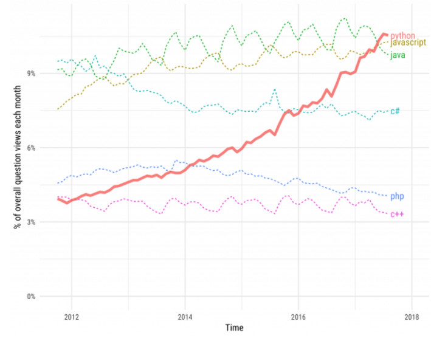
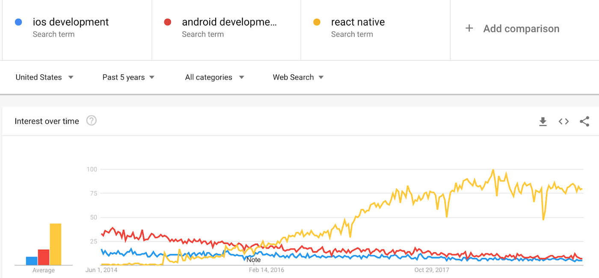
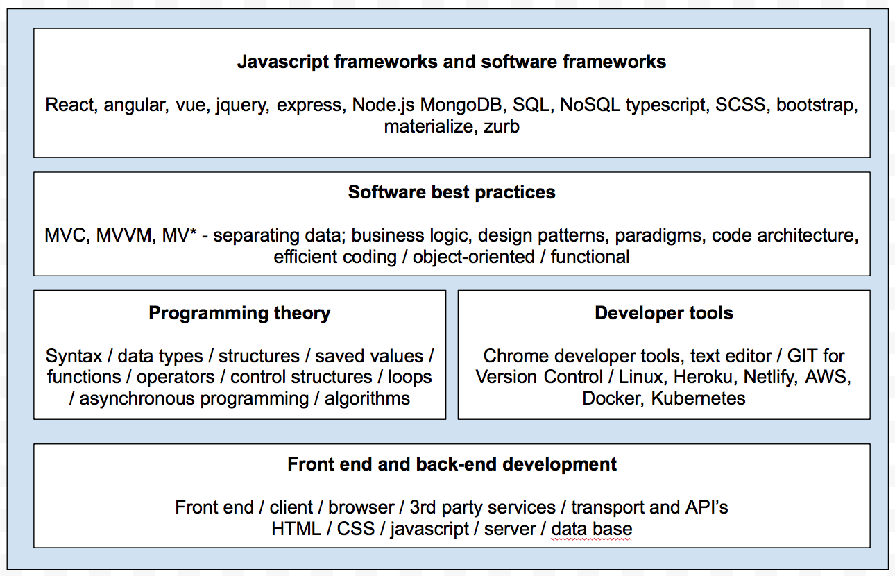

#Re-learning how to learn 

I’m now knee-deep in my journey to full stack software development. Earlier this May I jumped into a full stack software engineering program in London which I study for in evenings and weekends and will graduate from in November. I’m a novice coder but not new to the world of technology and engineering. Having worked in global internet companies like Twitter and Stripe for almost a decade on partnerships, business development and people management you engage with engineers on a daily basis around many different initiatives from customer product development, product feedback, GTM strategy and roadmaps, internal tools, internal infrastructure and more.

As a consequence you inevitably develop a technical vernacular and process in how best to engage with engineering and product teams on business challenges, some limited technical understanding of their world and a healthy respect for the art of product creation but never develop engineering skills in any meaningful capacity where you could be dangerous with an unlimited imagination and text editor open in front of you. From a coding perspective I am a complete beginner and am now focused on building this muscle from scratch where towards the end of the program I’ll be using core computer science concepts and working with tools and technologies to build full-stack applications.

Being unable to build software always bugged me throughout my career, particularly whilst on the coal-face of dealing with lighthouse customers taking product feedback and being unable to factor feedback & requirements into a product roadmap directly. In J.K Rowling’s series of books she refers to those who are unable to carry out magic as ‘squibs’ and that term has always stuck with me as an interesting parallel to software development!

##My Goals for this challenge

My goal is to un-squib myself and become proficient in software development by the end of 2019. With just a few short weeks of the program under my belt I’m realising that re-learning how to learn is the most important skill to nurture and be open-minded about at this point. Computing theory and knowledge of how the internet functions is of low utility when faced with a blank text editor and hitting cognitive load capacity in your first few weeks of ingesting new ideas, frameworks which are completely foreign. Taking a crawl, walk, run approach and learning by doing, succeeding and failing is where to take all positive signal comes from in your early learning curve.

There are many Mr. Miyagi moments in tactically focusing on minute aspects of features and functionality but it is all in the service of understanding high-level principles of programming and enabling these to compound over-time. On reflection I also find my learning style needs to be exponentially more curious and inquisitive in learning programming than any other subject matter differing from the critical thinking approaches I’ve used since university. Having played piano as a child it is remarkably similar to learning a new instrument; figuring out what keys and notes go together and practicing the addition and incorporation of various elements rapidly moving on to what’s next as soon as you’ve stumbled past the awkward learning moment.

The analogy is that coding is like weight lifting; it requires repetitive strain on your coding muscle in order to become proficient and develop its muscle memory. Equally, embracing the curiosity and challenge of learning is what enables me to ensure these habits become sticky and I continue to gain enjoyment from the act of learning to code. What I have come to realise is that the faster you understand there is no shortcut or bluff to a technical challenge the more effective a learner you will be. Coding is not like conducting a sales pitch, legal argument, speech or running a meeting; it is mostly binary and requires structural, semantic and programming knowledge to get from A to B and developing a personality trait in being satisfied with enjoying a high failure rate in getting to B.
Javascript for the full-stack developer

##An enviroment to learn code

I purposefully selected a bootcamp with javascript as the core programming language due to JS utility in both front-end and back-end development. I had also considered other languages like python or ruby but in any event you end up focusing on javascript for different tasks on front-end and back-end if using these languages. Ruby whilst easier for a beginner is less common nowadays and there is a trend of large tech companies like Twitter and Deliveroo migrating from Ruby over time when their needs become more complex. From an industry perspective javascript is widely adopted and the most ubiquitous programming language for both front-end and back-end development. Python is experiencing a rapid rise in popularity as an effective back-end language with data scientists and machine learning engineers driving this renaissance but is restricted to back-end development so for a full stack developer javascript is an attractive language to gain.

###Fullstack Javascript as my weapon of choice

Whilst the learning curve with javascript is steeper than learning ruby or other programming languages; my expectation is that knowledge of javascript will compound over the medium to long term and you don’t have to learn multiple languages when starting out which require increased syntax and language capacity. In industry javascript is also viewed as best-in-class due to :

* Speed. Javascript runs immediately within the client side browser saving bandwidth and making execution fast. It has no need to be compiled on client side and is not slowed down with network calls to a back-end server.
* Ubiquity. Javascript has broad popularity amongst the developer community and has tonnes of cutting edge frameworks and libraries.
* Rapid development. Being able to receive immediate feedback in the browser during the development process is a clear advantage in learning.
* Mobile advantages. Javascript (React) is fast becoming the best-in-class for mobile app development

Over the next number of months I’ll be tackling a bunch of new technologies, concepts and frameworks and thought it would be fun to document my key learnings throughout the process for two reasons; writing helps with rapid consolidation of learning and; being able to look back on my learning and how wrong I was in some of my assumptions should be an interesting thought experiment!
I’ll be documenting my learnings from my syllabus below periodically when I’ve hit various milestones. I’m focused on front-end development now so my next post will be on front-end with back-end and more complex computing exercises towards the end of summer.

Notwithstanding my main takeaways so far are:

* Learning to code is a process and not an outcome. You must enjoy the process, you’ve got to learn to associate positive rewards and cues with learning to code.
* Neat code creation. Viewing code creation as an aesthetic exercise breeds a more diligent and thoughtful programmer.
* Developer gunslinger skills. These is a term from my instructor around utilising knowledge for optimising time and effectiveness via advanced keyboard shortcuts and developing subconscious muscle memory on to use these consistently.
* Theory is no substitute for live coding. Theoretical understanding is driven mostly by doing not by reading. Theory is companion learning.
If you’d like to follow-on with my learning or are currently going through a similar journey I’d love to hear from you! You can get me on @RossySheil on Twitter.

*Originally published by [Ross Sheil](http://rossysheil.com/) on [Medium](https://medium.com/rossysheil/.*
