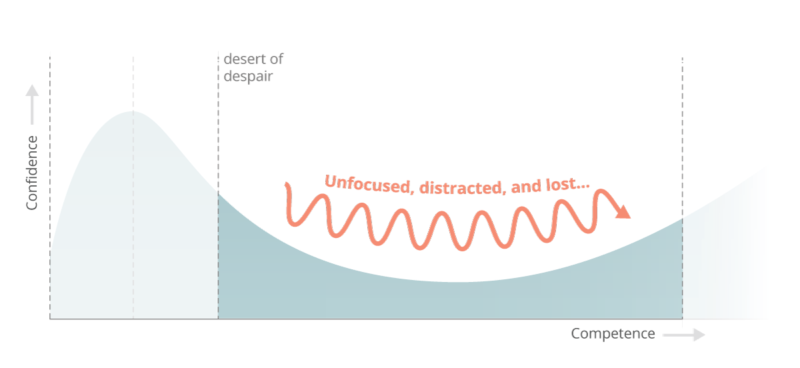

I’m 10 weeks into my full stack software engineering bootcamp in London with 20 weeks to go. I wonder is there some incarnation of the Dunning Kruger effect for would-be product builders learning to code; either way I’m currently in the thick of navigating my coding competence and learning curve aptly named ‘the desert of despair’ by Erik Trautman.



*The desert of despair by Eric Trautman.*

I jest and digress but seriously it’s pretty challenging! I’ve logged about 160hrs of web development practice so far and invest roughly 16hrs a week in coding time but have started to increase my time investment in excess of this recently which I notice is more strongly correlated with grasping concepts faster; practice really makes perfect with learning to code. At this point I find that time spent in visual studio code drilling concepts and working to commit these to understanding as opposed to learning theory is the fastest way to absorb repeatable techniques in practice.

#Investing time with highest reward

To date I’ve spent the majority of my time on the fundamentals of front-end development outlined below so I wanted to recap on how I’ve put this into practice and how I’m measuring progress in terms of my approach to learning and development.

The intensity and time investment requirements will ramp up as I hit week 13 so my priorities over the next two weeks are focused on drilling and digesting all of the key components of basic front end development along with CLI + GIT which serve as a required knowledge base to function as I move into more advanced programming, new languages and various computer science frameworks.

So on reflection what are the top 10 things I’ve learned about web development which beginners should grasp early in order to accelerate their own learning and development with software engineering?

**1.HTML5 is the basic building block of the internet**

I was a HTML5 snob before I started my bootcamp viewing it as a basic entry point to coding and turned my nose up at learning it in any depth however it is impossible to master web development without understanding how to build a skeleton and scaffold of a web page and later leverage this scaffolding with more advanced languages and frameworks.

HTML5 is a simple hyper text mark-up language that applies semantic meaning to a web page and is strictly presentational; there is no real coding logic but it is a key building block of the web. Every internet business in the world outputs HTML5 to the browser for presentation so is a key concept to master in understanding how to build a product. The syntax is straightforward consisting of element names surrounded by angle brackets with start and end tags containing the content of a given section. Generally I’ve found HTML5 to be straightforward and have had no difficulty in mastering the exercises during class. In the first couple of weeks I found it useful to run some of my markup through an HTML checker to highlight any anomalies and building increased expertise with a developer tool called Emmet to simplify my HTML 5 shorthand for more time efficient coding with HTML5 and CSS.

**2. Bias towards semantic structures as best practice**

It is best practice to bias towards semantic elements and structures in HTML5. It informs search engines of your intent for users, drives better accessibility, makes it easier for you to decipher your own code and has a myriad of SEO benefits. HTML5 was adopted in 2014 but as I browse the web looking at various products I’m incredibly surprised by the number of tech forward companies not using semantic markup to its full potential. It’s still very common to see developers with ‘divitis’ hacking together web pages with no semantic methodology. There are over 100 semantic elements for developers to use in building products. You can see an example of semantic HTML5 in this basic wireframe layout for OKR software I created.

**3. Block vs inline elements can be tricky at first**

HTML5 has two types of main elements; block level elements and inline elements which behave differently when sent to the browser. Block elements take up the full width of a web page blocking other elements from sitting next to it whilst inline elements take up as much width as needed to display the contents of the element. When you first start to position elements in HTML5 and CSS with border, padding, margin it can be confusing as to why various elements behave differently when rendered in the browser. Common block elements are ```<p>, <h1> to <h6>, <div>, <ul> and <li>``` whilst common inline elements are ```<span>, <images> and <anchors>```. As a beginner adding a border or background property will help you to visualise the layout better as the content box is invisible by default in the browser. You can also dictate the behaviour of these elements by changing the display state to display:block or display:inline so you are not stuck with the default state in perpetuity.

**4. Lists and forms are used A LOT in web development**

As I’ve developed more mock-ups it’s easy to start developing pattern recognition for the same elements, properties, values, selectors and layouts that are used in various scenarios and of these HTML5 lists and tables are used a lot on the web. Any time user information is to be captured and sent to a server by https or synchronously forms will be used. Any time items are displayed on a web page lists are used. Identifying the best practices for styling and manipulating forms and tables early in your web development journey will pay off in dividends as they are ubiquitous in web development and layouts.

**5. Mastering the box model is key to learning CSS**

Firstly, CSS is a language that controls page presentation from a user point of view. As a component of CSS the box model is the most common web layout on the internet. It impacts the display of an element presented as a rectangular box (everything is a box on the internet), with the box’s content, padding, border and margin layered on top of each other as properties to be controlled by the developer. The most common properties I find myself using on the box-model are min-width, max-width, min-height and max-height to set size constraints on an element. The default width and height is set by the size of the contained elements and other boxes which may represent nested child elements in your code such as a UI component like a button or a logo with layering. For example if I briefly pull up chrome developer tools to assess the properties of an avatar or button I like on another website such as Medium you can see assess the dimensions and visually investigate the layering on the property directly in the computed tab. This is also useful for inspecting block vs inline elements and understanding their behaviour.

**6. Use first principles thinking with class selectors**

I’ve found naming conventions for class selectors on elements to be very developer-specific. My tutor has his own unique way of naming selectors as do the other students in my cohort. This can throw a beginner initially into assuming dynamic functionality is tied to a specific selector but the reality is that they are named with subjectivity. Name your selectors in a way that makes sense to you to ensure you can think through your code more logically. I also use the comment functionality of ‘cmd + /’ liberally to logically think through my project structures in visual studio code. At its most basic level CSS uses a selector chain to control an element where the developer has earlier applied a class name to that element. The most common selectors I work with are element selectors, class selectors and adjacent class selectors which you can see used in my layout mock-up. The syntax is simple in that it identifies combination class names or the element explicitly.

CSS syntax is read from the right of your screen to the left so where ‘ul li’ is used as a selector it is selecting each child li of a ul in a selector chain; this is called a descendant combinator. More commonly you will want to isolate specific child items from a parent element or container for styling and this is achieved through the use of a child combinator so where .product > ul is created as a selector chain it is identifying every ul that is an immediate child of an element with a class of product. To provide a stronger user experience it is important to leverage the swath of selectors available like pseudo-selectors such as a:hover which can impact an elements state whilst the user hovers over an element and pseudo-elements which can impact element presentation when it is not contained directly in the DOM tree such as nth child. I’ve been incorporated all of these selectors to the basic prototype layout I’ve built here.

**7. Beware of CSS inheritance**

CSS inheritance and the selector specificity you use are explicitly linked so it is important to be mindful of the CSS inheritance rules as you are building your selector chains. The issue is that where no value has been specified on an element; the computed value of the parent element property gets transferred to the child element by default. Inheritance is a useful tool as a developer will generally want the same properties to be inherited across a project but there will be instances where this is not the case and I will want to override a rule by order of CSS in the document or specificity. Specificity is weighted from most value to least value across style attribute, ID, class/pseudo-class/attribute and elements. If you want to be very explicit about your CSS rules on a given property you can use the value !Important. This is pertinent if working with 3rd party API’s or frameworks which will have their own styling rules incorporated but generally viewed as a last resort with your own CSS.

**8. Build for responsiveness from day zero**

It’s a misnomer that we live in a multi-channel world. It is a given that a consumer will experience your product across multiple device types so building for this behaviour immediately is key to successful product experiences. Some of the more advanced layouts like CSS flexbox and CSS grid have responsive properties built into their makeup like the fractional unit and flex grow, shrink and basis but it is best practice to ensure your product is optimised for mobile consumption with designated breakpoints optimised for your users device viewport. This is best achieved through the use of media queries and the srcset property.

Media queries are a form of conditional CSS where a device viewport equates to true I can control the presentation of rows and columns on a mobile app or tablet to be stacked as is typical with mobile presentation. As an example in the CSS of this layout I built I can specify a UI menu component built for mobile to become invisible and change to a standard navigation bar with the below media query and render in the browser with a layout of 2 columns and 7 rows built for responsiveness leveraging the auto property.

```
@media screen and (min-width: 601px) {
.page-header nav {
display: flex;
}
.nav-menu-toggle {
display: none;
}
@media screen and (min-width: 601px) {
.software-explanation {
grid-template-columns: 1fr 1fr;
grid-template-rows: repeat(7, auto);
```

Similarly I can directly augment the `````` element in HTML5 with a srcset attribute to send different image sizes and types to the browser depending on the device type whilst using a CSS unit length of EM will ensure my fonts are responsive. Generally it is best practice to use relative unit lengths when building for a responsive experience to ensure fluidity and proportionality as opposed to fixed width layouts. This means avoiding the use of fixed widths like 320px and optimising for % or layout specific unit lengths in flexbox or grid that achieve the same affect.

**9. Layout perfection is your enemy**

As I’ve mastered foundational layouts like the box model I have gravitated towards more sophisticated layouts like flexbox, grid and 3rd party frameworks like Bootstrap, Zurb and Materialize. In the early innings of taking in lots of concepts I was aiming to lessen my cognitive load and of the mindset to select one of these frameworks to master but the reality is that it is better to be a jack of all trades and a master of none with CSS layouts. Each layout has its own benefits and is generally used in combination with one another. For example, flexbox is best suited to navigation bars and any one dimensional layout where spanning columns is a requirement like product listings on Airbnb or Deliveroo whereas CSS Grid is equally powerful for two dimensional layouts but does not have as many intricate properties for one dimensional layout as flexbox. Similarly bootstrap is an excellent framework for UI components like navigation bars, drop down menus, buttons which enable quick prototyping.

**10. Learn to consult your developer tools for troubleshooting and debugging**

Debugging and troubleshooting is a fact of life with programming and I was unprepared for the amount of time necessary for debugging across various assignments. Your developer tools will become your best friend and it is important to build a muscle in consulting your developer tools as part of the debugging process. This is a crucial step in figuring out why a layout doesn’t render itself, padding or margin is off centre, a media query is broken or why a property wasn’t inherited correctly and many many more issues. I’m still discovering the value of consulting chrome developer tools as my default is to troubleshoot in the editor but the tools are so much more powerful as you can live edit and get real time feedback in the browser with your adjustments. This one is still a work in progress for me.
My next post will be on building a responsive landing page for a SaaS prototype leveraging most of what I’ve laid out here and more. If you’re on a similar journey I’d love to hear from you feel free to reach out to me on Twitter on [@Rossysheil](https://www.twitter.com/rossysheil).
