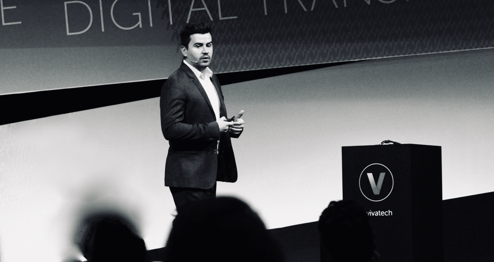
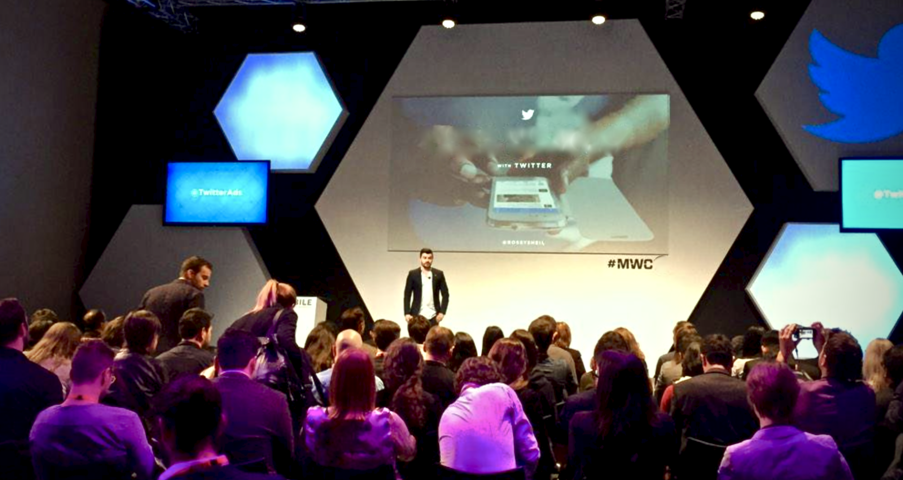

Hi there,

This is my blog! You can expect to write about being an operator, management, leadership, biohacking, reading and software engineering.

I'm currently Head of Startup Growth and Partnerships at Stripe UK & Ireland leading startup partnerships and go-to-market strategy for startups in Europe as the first global hire for this function at the company. I'm deeply entrenched within Europe's startup ecosystem serving as a venture scout and advisor with several London based vc funds. I also mentor founders on commercial strategy and go-to-market at funds like Seedcamp and Startupbootcamp.

*A keynote on mobile technology trends I gave at Viva Tech one of Europes largest tech conferences.*

From 2012 - 2017 I was hired as one of Twitters first international hires holding a wide variety of roles across product, sales and people management leading Twitter's expansion into the UK and across EMEA as Head of Mobile and senior management. Before I left Twitter I led Twitter's mobile strategy and product across Europe directly responsible for 40% of European revenues at peak. Prior to Twitter I ran business development and partnerships at a vc-backed startup in consumer technology where I successfully led European expansion into new markets like DACH and NORDICS.

*A keynote on consumer technology trends I gave at Mobile World Congress, the worlds largest mobile conference.*

Academia and knowledge creation has always been a big part of my life where I lecture a mobile technology module Dublin University of Technology to masters students and executive professionals. I am a forever learner and am currently studying software engineering in London working with fullstack javascript specializing in Mongo, Express, Node and React.

I have been [recognized for my work in the tech and mobile industry](http://www.businessofapps.com/top-10-mobile-advertising-experts) via [different publications](http://www.gamesauce.biz/2016/06/21/ross-sheil-gaming-and-mobile-at-the-cutting-edge-casual-connect-video) and have been invited to deliver keynotes at large global conferences like MWC, Viva Tech, Slush and others. I also own and operate The Scaling Startups Podcast where I speak with prominent founders and venture capitalists on the secret to building successful companies!